

# SheryAI

### Next-Generation AI-Native Knowledge Operating System for Video Lectures

**Transform any lecture, raw video, or academic document into a living, fully interactive knowledge workspace with semantic search, cognitive tutoring, and real-time concept synthesis.**

[Architecture](#✦-complete-system-architecture) • [Ingestion Pipeline](#✦-ai-ingestion-pipeline) • [Streaming Engine](#✦-streaming-ai-response-pipeline) • [Vector Retrieval](#✦-vector-retrieval-architecture) • [Deployment](#✦-production-infrastructure)

---

## ✦ Built for the Future of Intelligent Learning

Passive learning is fundamentally broken. Students spend hundreds of hours watching video lectures and reading massive documents, yet the knowledge inside remains static, un-searchable, and disconnected. 

SheryAI re-imagines lectures as dynamic knowledge graphs. By integrating deep semantic vector indexing with real-time audio transcription and a production-grade RAG pipeline, it allows learners to converse with their course materials, query topics through hybrid semantic searches, generate study guides, and visual-map cognitive milestones.

> [!IMPORTANT]
> **SheryAI is not a simple chatbot wrapper.** It is an enterprise-grade ingestion and retrieval infrastructure stack designed to process, segment, embed, index, and query unstructured media at scale with absolute grounding and zero hallucinations.

---

## ✦ Product Experience

SheryAI shifts the paradigm of digital learning from passive consumption to active dialogue:

* **Ingest and Transcribe**: Upload lecture recordings, PDFs, YouTube URLs, or audio clips.
* **Intelligent Synthesis**: The platform automatically partitions resources, extracts semantic tags, translates audio to text, and indexes content vectors.
* **Grounded Chat**: Converse with a dedicated AI Tutor whose responses are mathematically locked to your source documents to eliminate hallucinations.
* **Interactive Timestamps**: Click inline chat citations to instantly jump to the exact second in the video where a topic was discussed.
* **Assessment Labs**: Instantly synthesize flashcards, quiz pools, chronological timelines, and knowledge gap analyses.

---

## ✦ Platform Preview

## 1. Landing Page

Modern AI-native onboarding interface with cinematic gradients, adaptive layout system, and semantic navigation architecture.

  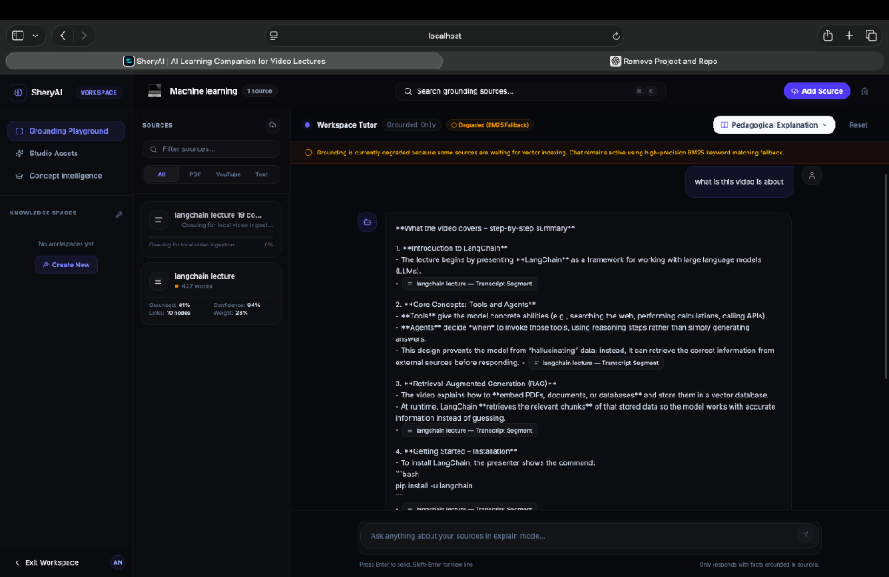

---

## 2. AI Workspace

Unified academic intelligence workspace integrating lecture ingestion, document synchronization, semantic retrieval, and contextual memory systems.

  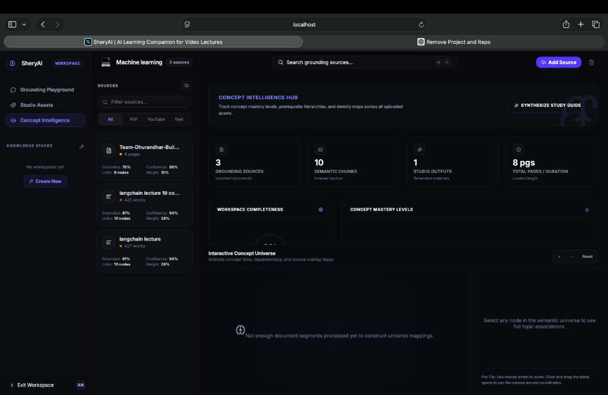

---

## 3. Lecture Intelligence

Real-time audio extraction, transactional state tracking, and state machine virtualization pipeline converting media files into transcription segments.

  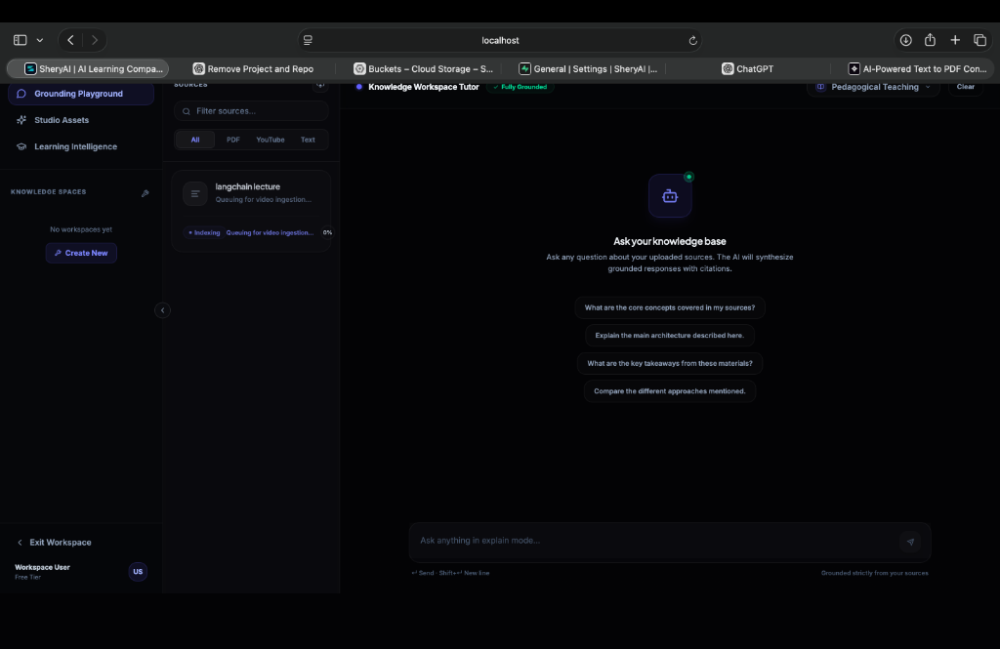

---

## 4. Semantic Tutor

Context-locked learning dialog interface supporting temporal references, interactive video synchronization, and grounded cognitive chat.

  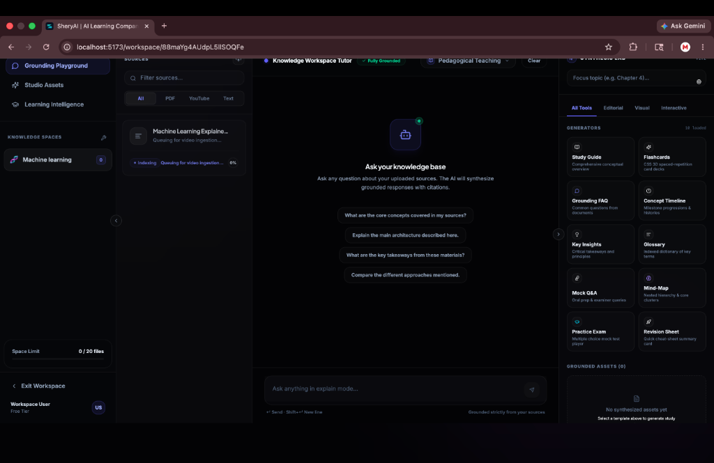

---

## 5. Knowledge Dashboard

Unified academic diagnostic suite presenting automated flashcards, quiz generation, cognitive gap analysis, and interactive lesson timelines.

  

---

## 6. AI Search Experience

High-performance search interface utilizing Reciprocal Rank Fusion (RRF) to merge semantic vector queries with lexical BM25 database scoring.

  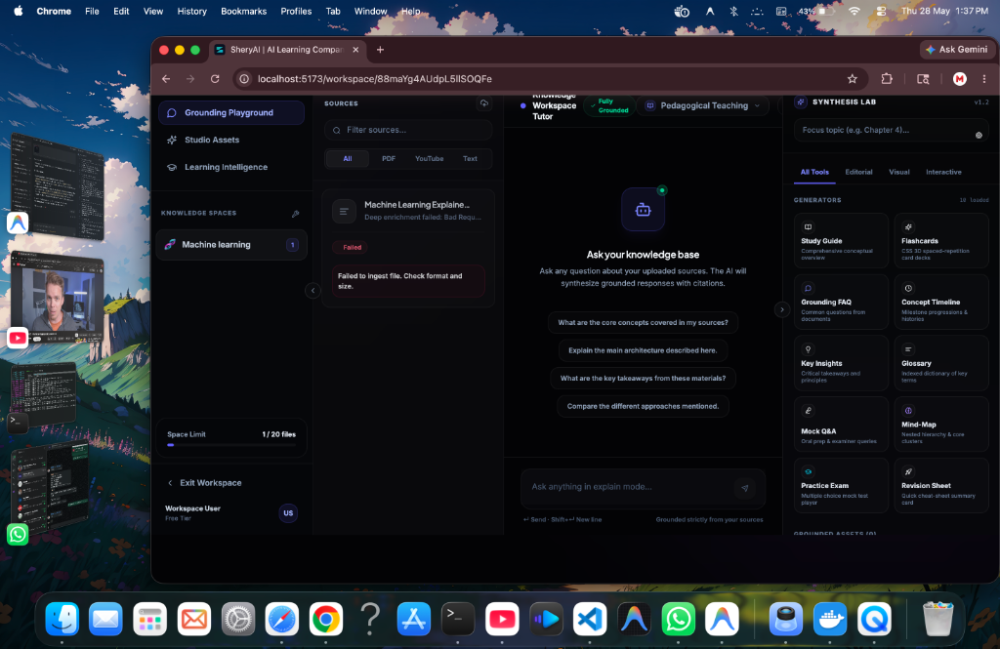

---

## ✦ Complete System Architecture

SheryAI is built on a highly decoupled, async-first architecture. It segregates API routing, heavy background compute workers, vector storage, and state tracking to prevent thread blocking and memory inflation.

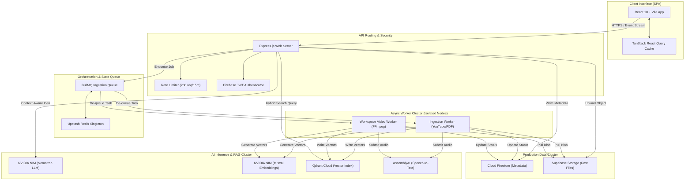

---

## ✦ AI Ingestion Pipeline

The platform utilizes a strict 7-stage transactional state machine. Every step is logged as a state checkpoint in Firestore and piped directly to the user interface in real time.

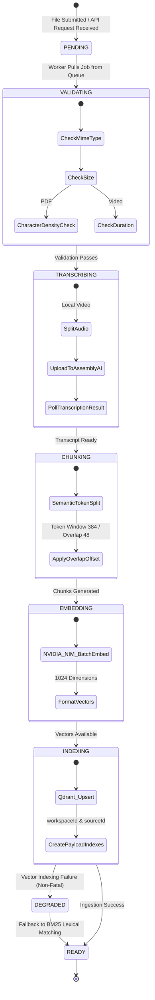

<b>Detailed Pipeline Stage Explanations</b>

### 1. Verification (VALIDATING)
* **Envelope Checks**: Validates files against strict parameters (e.g. maximum PDF size limits, audio track existence, and mime verification).
* **Character Density Diagnostics**: Scans PDF text density using class-based `PDFParse` systems to flag scanned page vectors that require image extraction.

### 2. Audio Extraction & Transcription (TRANSCRIBING)
* **FFmpeg Demuxing**: Video uploads are processed using sandboxed `ffmpeg` execution. The system isolates the raw audio channel and exports it into a compressed Mono-channel MP3 stream.
* **Speech to Text**: Streams audio segments to AssemblyAI endpoints. Implements continuous polling loops with custom fallback parameters.

### 3. Overlap Chunking (CHUNKING)
* **Token Boundaries**: Splits raw transcript strings into semantic text blocks.
* **Overlap Window**: Employs a token limit config of `384` with a safety overlap window of `48` tokens, ensuring context is preserved across split boundaries.

### 4. Multi-Dimensional Embedding (EMBEDDING)
* **NVIDIA NIM Generation**: Streams text blocks in batches to the `nv-embedqa-mistral-7b-v2` embedding engine.
* **Dense Vectors**: Generates a standard float array representing 1024-dimension semantic coordinates.

### 5. Vector Indexing (INDEXING)
* **Qdrant Upsert**: Performs high-throughput batch inserts of vectors into Qdrant Cloud.
* **Payload Indexing**: Idempotently establishes payload index definitions (`workspaceId` and `sourceId`) inside Qdrant collections to ensure sub-millisecond search latencies under concurrent workspace queries.

---

## ✦ Streaming AI Response Pipeline

To deliver a premium, near-instant user interface, responses are computed and streamed using Server-Sent Events (SSE). We wired cancelable abort signals from the browser directly to the inference layers to prevent orphaned processing costs.

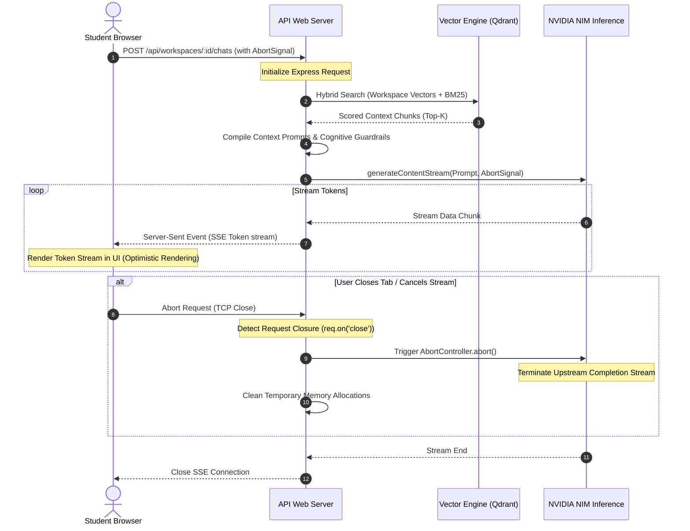

---

## ✦ Queue Orchestration System

SheryAI handles CPU-intensive task ingestion asynchronously using a Redis-backed queue system. This isolates heavy operations from request-handling API processes.

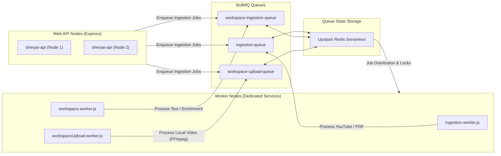

### Queue Resilience Architecture
* **Isolated Processing**: Background workers run as distinct, decoupled nodes. If a heavy FFmpeg encoding task crashes a worker container, the main Express API server continues handling traffic without interruption.
* **Concurrency Capping**: Configures strict limits on active concurrent processes (`concurrency: 2` for general ingestion, `concurrency: 3` for uploads) to prevent background CPU exhaustion on host systems.
* **Redis Connection Singleton**: All queues and workers reuse the same centralized, validated connection singleton exported from `redis.js`, ensuring we do not exhaust Redis connection limits.
* **Task Lock Extenders**: Spawns lock renewal processes (`lockRenewTime: 60s` on a `5-minute` lock duration) to prevent long-running transcription jobs from being misclassified as stalled and picked up twice.

---

## ✦ Vector Retrieval Architecture

SheryAI utilizes a hybrid search pipeline that combines dense vector semantic matching with classical lexical keyword lookups to deliver optimal grounded context results.

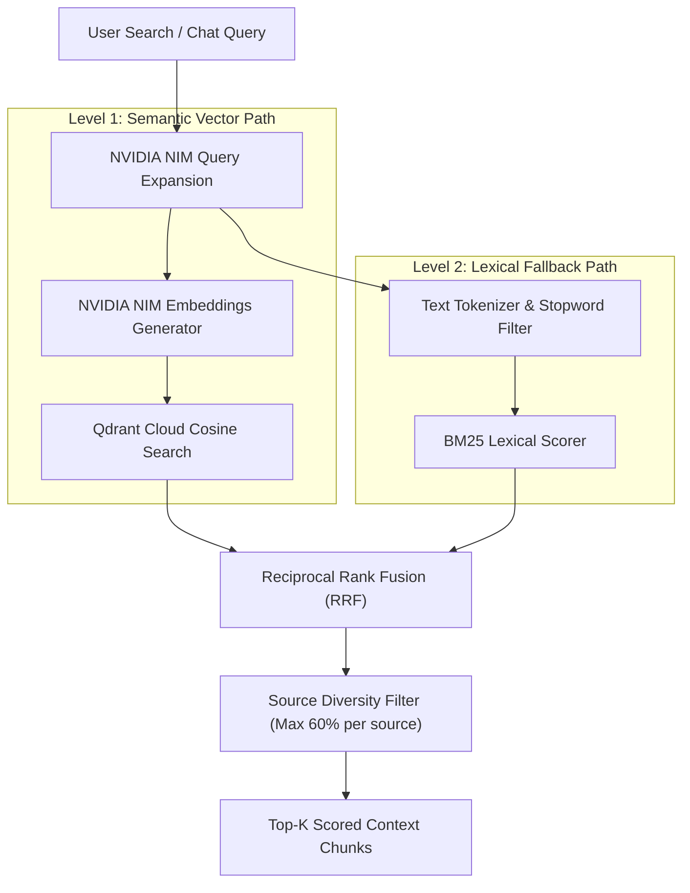

### Retrieval Layer Mechanics
* **Query Expansion**: Utilizes the fast NVIDIA Nemotron model to rewrite raw query inputs into a list of synonymous academic keywords, increasing the surface area for semantic searches.
* **Reciprocal Rank Fusion (RRF)**: Merges ranked results from semantic cosine searches and lexical keyword matching into a single, high-fidelity score:
  $$RRF\_Score(d) = \sum_{m \in M} \frac{1}{k + r_m(d)}$$
  where $k=60$ and $r_m(d)$ is the rank of document $d$ in the system path $m$.
* **Source Diversity Capping**: Limits the number of results from any single file to a maximum of **`60%`** of the total top-K return block. This ensures that the context provided to the model is diverse, rather than being dominated by a single source.

---

## ✦ Worker Lifecycle & Cleanup Flow

To guarantee absolute memory safety and prevent storage bloat, background workers follow a strict transactional job lifecycle, executing rollback cleanups immediately on failure.

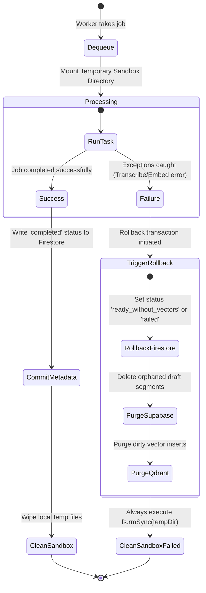

---

## ✦ Production Infrastructure

The platform is designed to deploy on cost-effective serverless cloud providers, utilizing free tier limits.

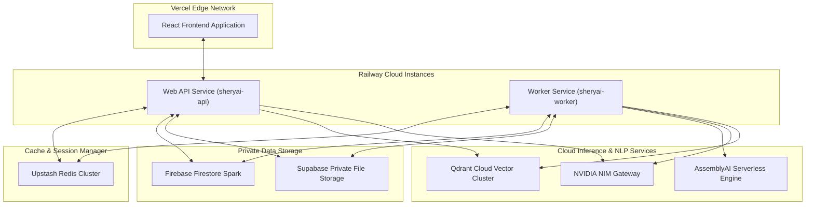

### Production Scaling Strategy
1. **Frontend Isolation**: The React application is deployed to Vercel's global edge network, ensuring fast asset delivery and static page loading.
2. **Process Segregation**:
   * **`sheryai-api`**: Configured with `RUN_API=true` and `RUN_WORKERS=false`. Exposes REST endpoints to clients.
   * **`sheryai-worker`**: Configured with `RUN_API=false` and `RUN_WORKERS=true`. Runs as an isolated worker cluster to process ingestion tasks.
3. **Serverless Cache Storage**: Utilizes Upstash Redis for BullMQ queue management. This keeps connection overhead minimal and ensures worker tasks run asynchronously.

---

## ✦ Performance Engineering

* **Connection Leak Protection**: Express controller routes listen to client connection closures and map `req.signal` downstream via custom `AbortController` boundaries. If a user cancels a query, upstream AI streams are terminated instantly to save token costs.
* **Thread-Safe Video Processing**: Background workers execute media operations within isolated sandboxed folders. Scoped `try...finally` boundaries ensure that temporary `/tmp/ws-vid-seg-*` directories are always cleaned up, even during unexpected task failures.
* **Fail-Safe Qdrant Ingestion**: Qdrant health checks feature an automatic retry backoff loop with exponential delays. If Qdrant is offline, the workspace falls back to a custom local BM25 keyword matching algorithm, keeping the application functional.

---

## ✦ Security & Reliability

* **Secure Credentials**: Production configurations block all localhost fallbacks. The application crashes immediately at startup if keys like `REDIS_URL` or `QDRANT_URL` are missing or misconfigured.
* **Helmet Hardening**: Configured 13 HTTP protection headers to defend against Cross-Site Scripting (XSS), clickjacking, and mime-sniffing exploits.
* **CORS Origin Shields**: Hardened REST gateways to allow requests exclusively from Vercel deployment domains and verified local development hosts.
* **Firebase Token Validation**: All authenticated workspace API routes enforce JWT token decoding and verify user ID matching prior to executing database queries.

---

## ✦ Design Philosophy

We believe learning should be active, conversational, and non-linear. 

Traditional lectures are linear, passive streams of information that cannot be efficiently indexed, cross-referenced, or queried. Students waste valuable hours scrubbing through timelines to find a single concept, or struggling through dense slides with no interactive context.

SheryAI shifts the paradigm. We turn static resources into conversational, structured partners. By linking interactive video control, automated vector grounding, and smart gap analysis, the application enables students to grasp complex topics faster, helps educators analyze student struggles, and ensures that knowledge is immediately accessible.

---

## ✦ Future Roadmap

* **Multimodal Retrieval**: Parse slides, visual charts, and blackboard frames into the semantic workspace context.
* **Collaborative Classrooms**: Allow multiple students to query a workspace concurrently, generating real-time group study graphs.
* **Live Lecture Capture**: Process active video streams in real-time, building interactive workspaces as the instructor speaks.
* **Autonomous Study Agents**: Spawn autonomous study agents to index research papers, test comprehension, and construct personalized study plans.

---

## ✦ Join the Future of AI Learning

SheryAI is an open-source project created to provide next-generation academic tutoring capabilities. If you love this project and want to build the future of AI learning tools with us:

* ⭐️ **Star the repository** to show your support and help other developers find us.
* 🍴 **Fork the project** and start contributing code updates.
* 🐛 **Submit issues** or feature requests on our tracker boards.

Let's build a smarter, more accessible future together.

---

*ISC License - © SheryAI*
