<div align="center">

# SheryAI

### Distributed, Asynchronous Knowledge Ingestion and Retrieval Engine for Video Lectures

[](https://github.com/madhavansingh/Shery/actions)
[](https://opensource.org/licenses/ISC)
[](https://nodejs.org/)
[](https://qdrant.tech/)
[](https://firebase.google.com/)
[](https://docs.bullmq.io/)
[](https://supabase.com/)

**An enterprise-grade, async-first ingestion and retrieval infrastructure stack designed to process, segment, embed, index, and query unstructured media at scale with absolute grounding and verified context retrieval.**

[System Architecture](#system-architecture) • [Control vs Data Plane](#control-plane-vs-data-plane) • [Request Lifecycles](#request-lifecycle-sequence-blueprints) • [AI Pipeline](#ai-processing-pipeline) • [Retrieval Engine](#semantic-retrieval-engine) • [Orchestration](#backend-orchestration) • [Failure Recovery](#failure-recovery--resilience) • [Deployment Topology](#deployment-topology) • [Security & Boundaries](#security-boundary-mapping)

</div>

---

## Introduction

Passive learning is fundamentally broken. Video lectures and academic documents contain rich, multi-dimensional information, yet the knowledge inside remains static, un-searchable, and disconnected.

SheryAI solves this by re-imagining lectures as dynamic, searchable knowledge graphs. By integrating deep semantic vector indexing with real-time audio transcription and a production-grade RAG pipeline, it allows users to converse with course materials, query topics through hybrid semantic searches, generate study guides, and visual-map cognitive milestones.

SheryAI is not a simple chatbot wrapper. It is a decoupled backend processing infrastructure that coordinates CPU-heavy workflows outside the API request lifecycle, serving structured answers mathematically locked to source documents.

---

## System Architecture

SheryAI is built on a highly decoupled, async-first architecture. It segregates API routing, heavy background compute workers, vector storage, and state tracking to prevent thread blocking and memory inflation.

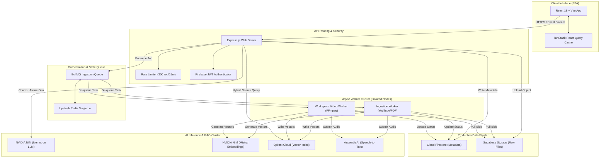

---

## Control Plane vs Data Plane

To ensure maximum runtime reliability and operational throughput under high concurrent ingestion workloads, the system strictly segregates its components into two functional planes:

### Control Plane
Governs system state, schedules tasks, and orchestrates resource allocations.
*   **Queue Coordination**: BullMQ manages job schedules, state machines, and active job distribution.
*   **Storage Access Control**: Handles generation of short-lived signed URLs (TTL 3600s) for private Supabase Storage buckets, isolating raw files.
*   **Worker Lifecycle Monitoring**: Employs lock extenders (`lockRenewTime: 60s`) and heartbeats to ensure workers are healthy and restart stalled tasks.
*   **Database Coordination**: Firestore logs operational metadata, task statuses, user sessions, and task logs.

### Data Plane
Moves, parses, processes, and queries the actual learning content payloads.
*   **Text/Audio Extraction**: Sandboxed FFmpeg demuxes audio tracks to mono-channel MP3s, and PDF parsing engines extract textual content.
*   **Vectorization**: NVIDIA NIM generates 1024-dimension float coordinate embeddings from chunks.
*   **Vector Operations**: Qdrant stores, indexes, and queries vector points with high-speed payload filters (`workspaceId` and `sourceId`).
*   **Stream Transport**: Pipes Server-Sent Events (SSE) token streams to the frontend.

---

## System Constraints & Tradeoffs

Architectural choices are selected based on distributed systems tradeoffs, balancing simplicity, performance, and fault tolerance:

*   **Server-Sent Events (SSE) vs. WebSockets**: Chosen for text-streaming responses. SSE operates natively over standard HTTP, features automatic reconnection, and bypasses the proxy-traversal and frame-handshake complexity associated with full bidirectional WebSockets.
*   **BullMQ vs. Kafka**: BullMQ on Redis provides lightweight, transaction-safe task queues with instant state change hooks, fitting our workflow-state pipeline better than a partition-centric commit log like Kafka.
*   **Qdrant vs. Pinecone**: Qdrant was selected for its native support for direct payload-based metadata filtering (`workspaceId` and `sourceId`), ensuring strict workspace isolation at the database level and avoiding global search space leakage.
*   **Local BM25 Fallback**: If the Qdrant Cloud cluster experiences latency spikes or outages, retrieval degrades gracefully to an in-memory BM25 lexical keyword search, ensuring chat and assessment features remain available.
*   **Chunk Overlap Allocation**: Chunking uses a `384` token boundary with a `48` token overlap. This balances retrieval granularity (preventing context fragmentation) with LLM attention window constraints.
*   **Process Segregation**: Segregating API gateways (`RUN_API=true`) from workers (`RUN_WORKERS=true`) ensures that CPU-intensive operations like FFmpeg demuxing do not block event loops handling HTTP requests.

---

## Request Lifecycle Sequence Blueprints

### 1. Context-Grounded Chat Request Lifecycle

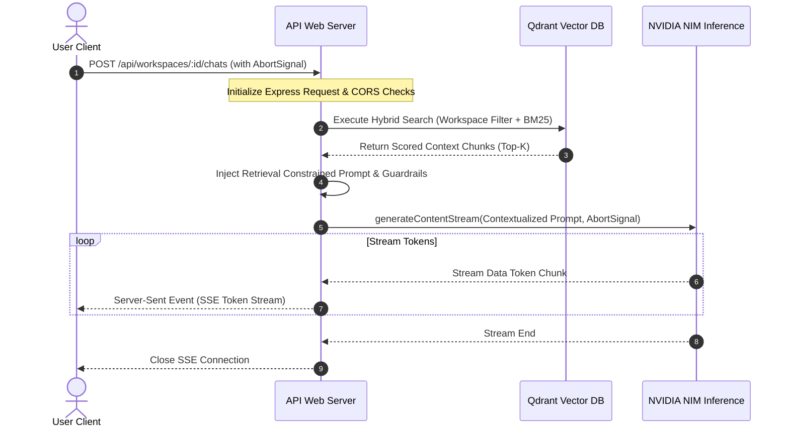

### 2. Ingestion Cancellation and Abort Propagation

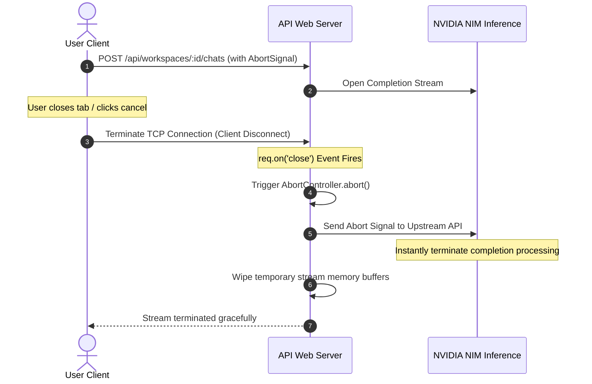

---

## AI Processing Pipeline

The platform utilizes a strict 7-stage transactional state machine. Every step is logged as a state checkpoint in Firestore and piped directly to the user interface in real time.

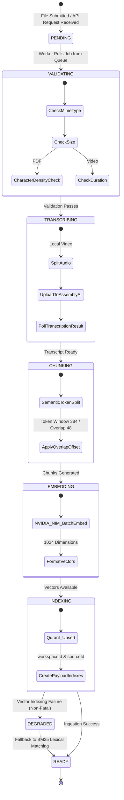

### Ingestion Stages

1. **Verification (VALIDATING)**: Validates file envelopes (e.g. maximum PDF size limits, audio track existence, and mime verification). Executing class-based PDF text density checks to flag scanned pages that require image extraction.
2. **Audio Extraction & Transcription (TRANSCRIBING)**: Video uploads are processed using sandboxed `ffmpeg` execution. The system isolates the raw audio channel and exports it into a compressed Mono-channel MP3 stream before sending to AssemblyAI endpoints.
3. **Overlap Chunking (CHUNKING)**: Splits raw transcript strings into semantic text blocks. Employs a token limit config of `384` with a safety overlap window of `48` tokens to preserve contextual continuity.
4. **Multi-Dimensional Embedding (EMBEDDING)**: Streams text blocks in batches to the `nv-embedqa-mistral-7b-v2` embedding engine to generate 1024-dimension dense vector representations.
5. **Vector Indexing (INDEXING)**: Performs high-throughput batch inserts of vectors into Qdrant Cloud. Idempotently establishes payload index definitions (`workspaceId` and `sourceId`) inside Qdrant collections to ensure sub-millisecond search latencies.

---

## Semantic Retrieval Engine

SheryAI utilizes a hybrid search pipeline that combines dense vector semantic matching with classical lexical keyword lookups to deliver grounded context results.

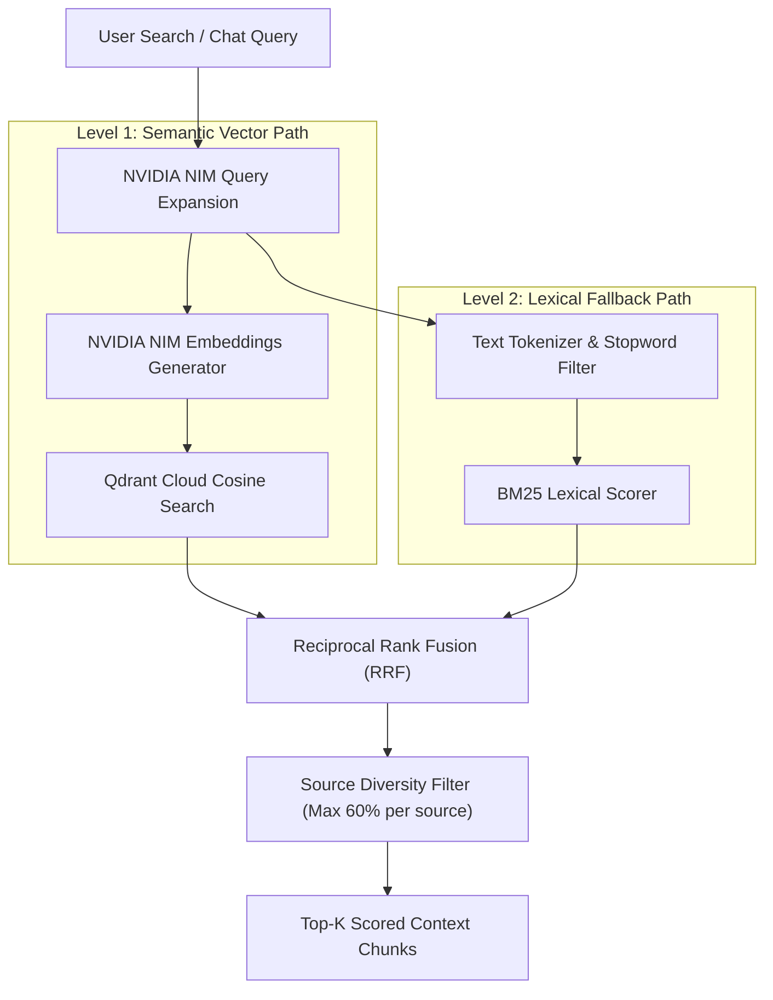

### Retrieval Layer Mechanics

* **Query Expansion**: Utilizes the fast NVIDIA Nemotron model to rewrite raw query inputs into a list of synonymous academic keywords, increasing the surface area for semantic searches.
* **Reciprocal Rank Fusion (RRF)**: Merges ranked results from semantic cosine searches and lexical keyword matching into a single, high-fidelity score. RRF score calculations are computed with a constant factor ($k=60$).
* **Source Diversity Capping**: Limits the number of results from any single file to a maximum of `60%` of the total top-K return block. This ensures that the context provided to the model is diverse, rather than being dominated by a single source.
* **Conversational Memory**: Chat sessions manage conversational history via Firebase Firestore array bindings, capped at a maximum of `40` messages to optimize memory footprint and respect token window boundaries during upstream completions.

---

## Observability & Runtime Telemetry

Runtime visibility is achieved through a structured telemetry and logging pipeline, ensuring operational visibility at every stage:

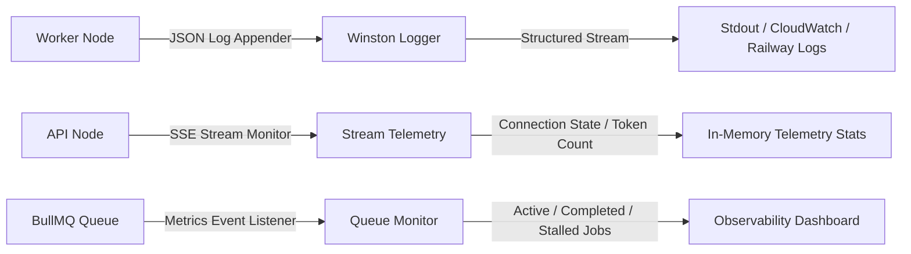

*   **Ingestion Timings**: Winston structures logs with trace contexts (`workspaceId`, `sourceId`, `jobId`), capturing processing durations for validation, audio extraction, chunking, and vector indexing.
*   **Queue States**: Listeners attach to BullMQ queue transitions, recording job statuses (`active`, `completed`, `failed`, `stalled`) and reporting queue depth.
*   **Streaming Metrics**: The SSE connection engine monitors byte count and token metrics per stream, recording generation rates and tracking AbortController triggers.

---

## Backend Orchestration

SheryAI handles CPU-intensive task ingestion asynchronously using a Redis-backed queue system. This isolates heavy operations from request-handling API processes.

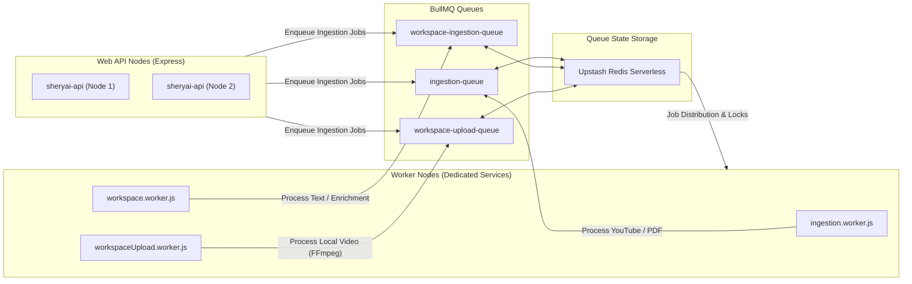

### Queue Resilience Architecture

*   **Isolated Processing**: Background workers run as distinct, decoupled nodes. If a heavy FFmpeg encoding task crashes a worker container, the main Express API server continues handling traffic without interruption.
*   **Concurrency Capping**: Configures limits on active concurrent processes (`concurrency: 2` for general ingestion, `concurrency: 3` for uploads) to prevent background CPU exhaustion on host systems.
*   **Redis Connection Singleton**: All queues and workers reuse the same validated connection singleton from `redis.js` to prevent connection leaks.
*   **Task Lock Extenders**: Spawns lock renewal processes (`lockRenewTime: 60s` on a 5-minute lock duration) to prevent long-running transcription jobs from timing out.

---

## Failure Recovery & Resilience

The background processor handles faults gracefully by containing errors within sandboxed boundaries, isolated from main client gateways:

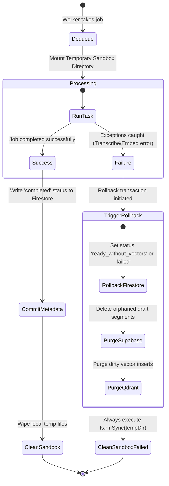

### Ingestion Rollback Semantics
When a fatal exception is intercepted during workers execution (e.g. an AssemblyAI timeout or Qdrant connection drop), the worker initiates a structured rollback transaction:
1.  **Firestore Lock Release**: Sets the source document status to `failed` or `ready_without_vectors` (for non-fatal indexing drops).
2.  **Supabase Cleanup**: Deletes raw file fragments uploaded during the session.
3.  **Qdrant Purge**: Issues a delete request matching the `sourceId` to wipe partially indexed vectors.
4.  **Sandbox Removal**: Executes `fs.rmSync(tempDir)` to free container storage.

---

## Performance Characteristics

Systems optimization strategies are implemented to ensure low latency and resource safety:

| System Component | Optimization Strategy | Target Metrics / Mechanics |
| :--- | :--- | :--- |
| **Streaming Engine** | Incremental Token Rendering | Pipes tokens via Server-Sent Events (SSE) immediately to bypass JSON buffering latency. |
| **Retrieval Engine** | Hybrid RRF Scoring | Merges Qdrant dense vector cosine queries with local BM25 scoring, capping single-source retrieval at 60%. |
| **Worker Ingestion** | Decoupled Concurrency Controls | Caps active operations per node (`concurrency: 2`) to prevent CPU context-switch overhead. |
| **Storage Delivery** | Temporary Signed Access URLs | Supabase assets are accessed using signed URLs valid for 3600 seconds, protecting backend storage. |
| **Cleanup Routines** | Scoped `finally` Garbage Collection | Ephemeral video and audio fragments are swept immediately upon completion or failure. |
| **Queue Operations** | Non-blocking Redis Singletons | Reuses a single Redis connection across BullMQ registries, preventing TCP port exhaustion. |

---

## Distributed Processing Model

SheryAI operates as a stateless distributed topology, dividing traffic handling from heavy media parsing:

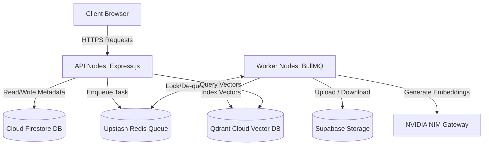

*   **Stateless API Scaling**: API nodes have no local session state, allowing them to scale out horizontally behind load balancers.
*   **Isolated Compute Nodes**: Worker nodes scale independently to allocate CPU/IO resources for transcription and video processing.
*   **Decoupled State Sharing**: State sync between APIs and workers occurs asynchronously via Redis queues and Firestore metadata flags.

---

## Engineering Decisions

*   **Queue Segregation**: Separating ingestion from API serving ensures that heavy background processes (like video transcription and embedding) do not block the event loop or exhaust memory on nodes serving HTTP requests.
*   **Unidirectional SSE over WebSockets**: WebSockets introduce connection state complexity, heartbeats, and scale-out routing challenges. SSE utilizes standard HTTP routes, simplifying load balancing and supporting client connection cancellation natively via standard requests.
*   **Custom BM25 Fallback**: By utilizing local in-memory BM25 indices as a secondary path, we protect the user experience from downstream cloud database outages, providing high availability.
*   **Stateless Worker Architecture**: Background workers store no persistent application state locally. All segments are held in transient `/tmp/` sandboxes and finalized in Supabase Storage, enabling workers to crash and restart without data loss.

---

## Failure Domain Isolation & Fault Containment

The architecture isolates faults to prevent cascading system failures:

```mermaid
graph TD
    Client[Client Browser] -->|API Boundary| APINode[Express API Server]
    APINode -->|Queue Boundary| Queue[Upstash Redis Queue]
    Queue -->|Worker Boundary| WorkerNode[BullMQ Background Worker]
    WorkerNode -->|Isolated Sandbox| TempFolder[/tmp/ws-vid-seg-*]
    
    subgraph FailureContainment ["Failure Containment Zones"]
        TempFolder -.->|CPU/IO Exhaustion / Crash| WorkerNode
        WorkerNode -.->|Worker Crash / OOM| Queue
        Queue -.->|Queue Delay| APINode
    end
    
    subgraph DataDegradation ["Data Fallback Paths"]
        APINode -->|Primary Path| Qdrant[Qdrant Cloud Vector DB]
        APINode -->|Graceful Fallback| BM25[Local BM25 Retrieval Engine]
        Qdrant -.->|Connection Timeout / Offline| BM25
    end
```

*   **API-Worker Separation**: A worker container crashing due to a heavy FFmpeg OOM does not impact the API gateway's ability to serve traffic or accept new jobs.
*   **Compartmentalized Queues**: General ingestion, local video processing, and file uploads run on separate BullMQ queues. High traffic in video processing does not delay basic document parsing.
*   **Fallback Retrieval**: If Qdrant experiences connection timeouts, the API switches automatically to BM25 query fallback, maintaining core workspace features.

---

## Resource Lifecycle Management

*   **Temporary Sandbox**: Sandboxed directories `/tmp/ws-vid-seg-*` are allocated per video processing task. Worker classes delete these folders inside `finally` blocks, ensuring disk resources are cleaned up.
*   **AbortSignal Tracking**: API handlers listen for client TCP connection terminations. Disconnects trigger abort events that propagate upstream to stop inference generation, saving computing credits.
*   **Redis Connection Pools**: Standardizes on a single Winston-monitored Redis connection instance to prevent connection leaks under load.

---

## Consistency & Reliability Model

*   **Eventual Index Consistency**: Ingested chunks are upserted to Qdrant Cloud. Collection indexing is eventual, meaning chunks become searchable immediately after the Qdrant sync commit completes.
*   **Ingestion Idempotence**: Reprocessing the same PDF or video checks for document presence, updates Firestore metadata keys, and replaces existing Qdrant points with new vector inputs using identical chunk IDs.
*   **Write Rollbacks**: If a task fails mid-way, the cleanup manager initiates `rollbackSource` to purge all draft metadata and vectors, preventing orphaned indexes.

---

## Security Boundary Mapping

Network and access boundaries are structured to enforce least-privilege security:

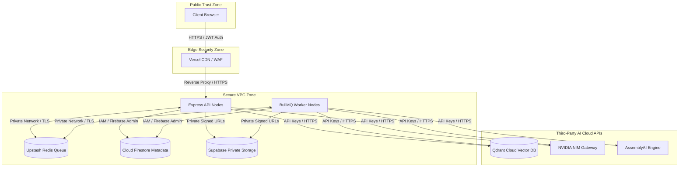

*   **API Isolation**: API nodes authenticate all client requests by parsing JWT tokens via Firebase Admin SDK.
*   **Private Asset Delivery**: Raw media files reside in private storage buckets. Access is mediated exclusively through temporary signed URLs.
*   **Credential Containment**: Third-party credentials (NVIDIA, AssemblyAI, Qdrant keys) are kept isolated in backend runtime configurations and never leaked to the client browser.

---

## Operational Philosophy

*   **Reliability over Hype**: Focus on robust distributed systems architecture rather than complex, ungrounded agentic loops.
*   **Observability-first Design**: System behaviors, ingestion stages, and network failures are monitored via structured logging and tracing metrics.
*   **Retrieval-grounded Inference**: Restricts model responses to verified database documents, preventing hallucinations.
*   **Graceful Degradation**: Core features continue operating via BM25 lexical backups during downstream service disruptions.

---

## Knowledge Processing Lifecycle

Unstructured lectures and documents are progressively mapped and transformed into queryable, context-grounded learning graphs with semantic memory. The diagram below represents the exact flow of data from ingestion start to complete indexing:

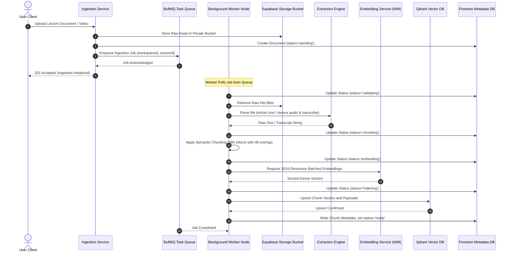

---

## Future Systems Expansion

*   **OpenTelemetry Integration**: Standardize metrics and traces by wiring OpenTelemetry SDKs into Express and BullMQ worker processes.
*   **Retrieval Evaluation Framework**: Integrate automated pipelines (e.g. Ragas) to run continuous grounding and context recall checks on test datasets.
*   **GraphRAG Cognitive Maps**: Parse document structures to construct graph nodes representing core lecture topics.
*   **Distributed Vector Sharding**: Implement custom collection sharding partitions in Qdrant based on workspace tenants to support scale-out search.
*   **Collaborative Workspaces**: Introduce real-time shared workspace states via delta sync protocols.

---

## Roadmap

*   **Multimodal Retrieval**: Parse slides, visual charts, and blackboard frames into the semantic workspace context.
*   **Collaborative Classrooms**: Allow multiple students to query a workspace concurrently, generating real-time group study graphs.
*   **Live Lecture Capture**: Process active video streams in real-time, building interactive workspaces as the instructor speaks.
*   **Autonomous Study Agents**: Spawn autonomous study agents to index research papers, test comprehension, and construct personalized study plans.

---

## Contributing

SheryAI is an open-source project created to provide next-generation academic tutoring capabilities. If you want to contribute to the codebase:

*   **Star the repository** to show your support and help other developers find us.
*   **Fork the project** and start contributing code updates.
*   **Submit issues** or feature requests on our tracker boards.

---

*ISC License - © SheryAI*
