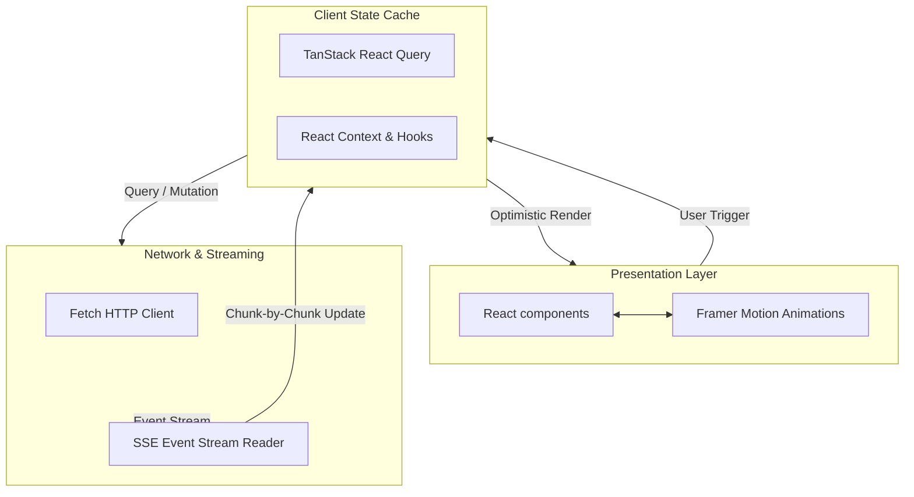
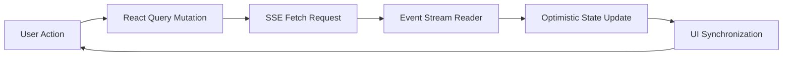

# SheryAI Frontend

### The AI-Native Cognitive Interface for Video Lecture Workspaces

**A high-fidelity, responsive single-page application built for streaming RAG interactions, interactive video control, and visual learning graph synchronization.**

[Architecture](#✦-frontend-architecture) • [Core Systems](#✦-core-systems) • [Data Flow](#✦-state--data-flow) • [Tech Stack](#✦-frontend-stack)

---

## ✦ UI Preview

* **Landing Page**: Sleek dark-mode interface with glassmorphic elements and CSS animations.
* **AI Workspace**: A dual-pane layout that coordinates video control with an interactive tutor.
* **Lecture Interface**: State machine status cards that track background transcription progress.
* **Semantic Tutor**: A streaming chat panel featuring citations linked directly to video timestamps.
* **Dashboard**: Autogenerated quizzes, timers, Timelines, and topic graphs.

---

## ✦ Frontend Architecture

This client is structured as a unidirectional state-driven interface designed to support real-time server-sent events (SSE):

---

## ✦ Core Systems

* **Streaming Chat UI**: Handles real-time Server-Sent Events (SSE) stream parsing. Implements auto-scrolling with user interrupt overrides and custom text render boundaries.
* **Semantic Workspace**: A dual-pane interface linking Markdown transcripts and interactive PDF canvases. Operates on unified scroll position coordinate queries.
* **AI Tutor Interface**: Features timestamped citations that link chat responses to the lecture player. Clicking a link sets target coordinates in the video timeline.
* **Context Panels**: Sidebar components housing active workspaces, source directories, and cognitive indexes with instant loading states.
* **Progress Dashboard**: Interactive timeline trackers, smart quizzes, timelines, and concept gap diagnostics.
* **Responsive Layout Engine**: Uses Tailwind CSS v4 to provide a mobile-friendly interface suited for phones, tablets, and desktop displays.

---

## ✦ State + Data Flow

State updates are unidirectional and optimized for network resilience:

---

## ✦ Performance Engineering

* **Real-time Stream Cancellation**: Hooks up native `AbortController` signals to outgoing network requests, terminating upstream AI streams the moment a user cancels a chat.
* **Optimistic UI Updates**: Employs TanStack Query mutations to update chat logs and source additions instantly, keeping interactions responsive.
* **Granular Route Splitting**: Implements dynamic lazy loading and code splitting to minimize initial bundle size and speed up page load.
* **Micro-Interaction Optimizations**: Offloads heavy animations to Framer Motion GPU hardware-accelerated transforms to keep transitions smooth.
* **Resource Caching**: Cache profiles for transcripts, lessons, and workspaces prevent redundant network fetches.

---

## ✦ Frontend Stack

| Library | Category | Purpose |
|---|---|---|
| **React 18** | UI Core | Component-based rendering engine. |
| **Vite 6** | Build Tool | Development server and bundle compiler. |
| **Tailwind CSS v4** | Styling | Styling utilities and custom layout rules. |
| **Framer Motion** | Animation | Fluid micro-interactions and transitions. |
| **TanStack Query** | Data Fetching | Server state caching and optimistic updates. |
| **Lucide React** | Icons | SVG icons. |

---

## ✦ Deployment

* **Target Platform**: Deployed to Vercel's global edge network.
* **Environment Control**: Standardizes on the `VITE_` prefix convention. Any backend key lacking this prefix is excluded from client bundles to prevent credential leaks.
* **Production Builds**: Pre-compiles layout structures, runs route tree validations, and runs static analysis before publishing.