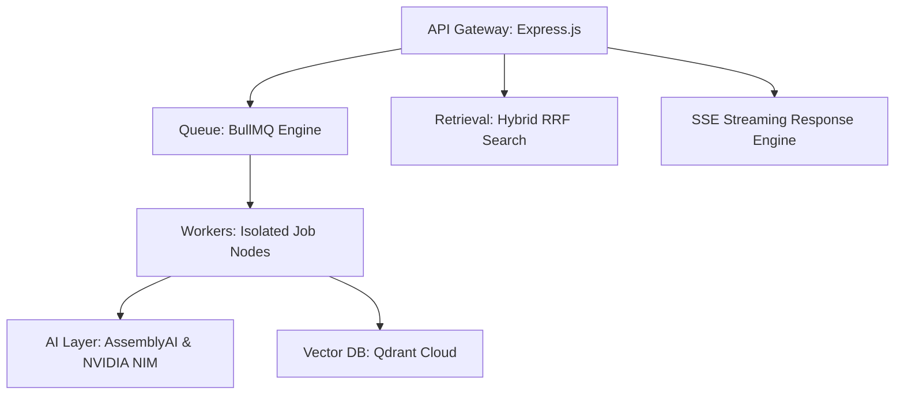
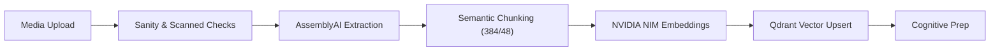
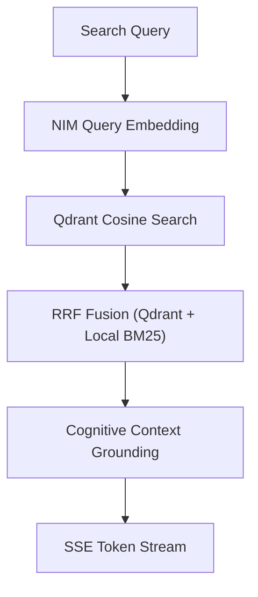
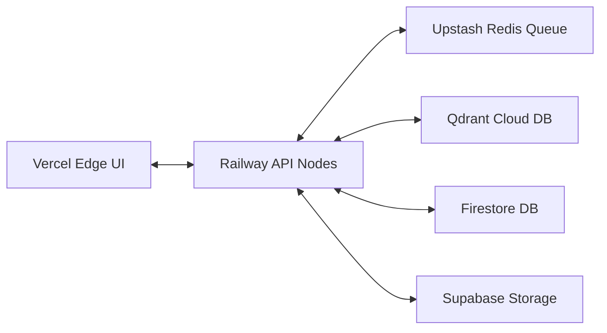

# SheryAI Backend

### Production-Grade AI Ingestion, Semantic Retrieval, and Queue Orchestration Engine

**The asynchronous task coordination, RAG vector retrieval, and pipeline processing backend for the SheryAI learning platform.**

[Architecture](#✦-backend-architecture) • [Ingestion](#✦-ai-ingestion-pipeline) • [Retrieval](#✦-retrieval-architecture) • [Deployment](#✦-deployment-topology)

---

## ✦ Backend Architecture

An asynchronous, ESM-native architecture designed to coordinate heavy computational workloads outside the HTTP request lifecycle:

---

## ✦ AI Ingestion Pipeline

Unstructured media and documents are ingested through a 7-stage state machine:

---

## ✦ Queue Infrastructure

Background workloads are distributed across dedicated queues to maintain low latency:

* **BullMQ Orchestration**: Processes general ingestion, local video processing, and vector indexing tasks concurrently.
* **Redis Connection Singleton**: Reuses a single centralized `redisConnection` instance across all queues and workers to prevent connection leaks.
* **Worker Isolation**: General ingestion tasks (`concurrency: 2`) and local video processing tasks (`concurrency: 3`) run as decoupled services, preventing CPU starvation.
* **Robust Fail-Safe Recovery**: Configures a 5-minute task lock with active background extenders to prevent long-running transcription tasks from timing out.
* **Automatic Rollbacks**: Catches task failures, sets the workspace state to `ready_without_vectors`, deletes intermediate Supabase files, and purges incomplete vector insertions.

---

## ✦ Retrieval Architecture

RAG context retrieval uses a hybrid search algorithm to ground AI answers:

* **Hybrid Search**: Combines Qdrant vector search with a local BM25 keyword matching fallback system.
* **Reciprocal Rank Fusion**: Merges semantic and lexical scores, weighting context chunks dynamically.
* **Context Grounding**: Limits results from a single source to a maximum of 60% of the total context block, ensuring diverse reference materials.

---

## ✦ Production Engineering

* **Request Abort Signal Mapping**: Maps client request cancellations (`req.signal`) downstream to terminate active LLM model streams, preventing unnecessary token costs.
* **Isolated Video Demuxing**: Runs FFmpeg operations within isolated sandboxed directories. Uses double-layer `try...finally` blocks to ensure temporary directories are cleaned up on error.
* **Scalable Service Splits**: Supports running in three modes depending on config settings: API-only mode (`RUN_WORKERS=false`), Worker-only mode (`RUN_API=false`), and Monolith mode (both active).
* **Redis and Qdrant Hardening**: Shuts down immediately at boot time if environment connection strings are missing, preventing silent local fallbacks in production.

---

## ✦ Infrastructure Stack

| Service | Category | Purpose |
|---|---|---|
| **NVIDIA NIM API** | Inference Layer | Powering chat generations and generating 1024-dimension embeddings. |
| **AssemblyAI** | Audio Pipeline | Serverless speech-to-text transcription engine. |
| **Qdrant Cloud** | Vector Storage | Real-time dense vector storage and hybrid indexer. |
| **Firestore** | Core Metadata | Document database tracking users, chats, and workspaces. |
| **Upstash Redis** | Queue State | Serverless task manager backing BullMQ. |
| **Supabase** | Object Storage | Private storage bucket hosting PDFs and videos. |

---

## ✦ Deployment Topology

---

## ✦ Reliability + Security

* **Queue Resilience**: Workers operate on distinct threads. If a heavy FFmpeg process crashes a worker container, the main Express API server continues handling traffic.
* **Environment Isolation**: Production services require valid HTTPS configurations. All API endpoints check and validate JWT Firebase tokens.
* **Cleanup Guarantees**: Temporary directories and database drafts are cleaned up immediately following both successful runs and failed tasks.
